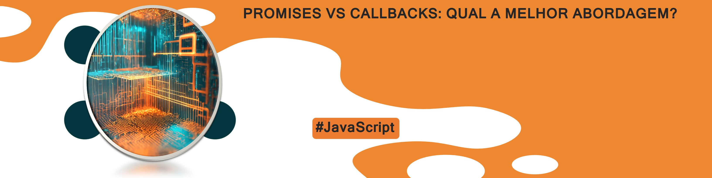

    

-------

# Projeto Artigo Gerado por I.A.s

 > ℹ️ **NOTE:** Este é o repositório desenvolvido durante o curso no qual fui aluno na plataforma da [DIO](https://dio.me)

Projeto com o objetivo de gerar um artigo digital com as facilidades das ferramentas de IA. todos os prompts
seguem abaixo.

<a href="https://www.dio.me/articles/promises-vs-callbacks-qual-a-melhor-abordagem-em-javascript" title="View now"> 📕Clique aqui para ler</a>

## 💻 Tecnologias utilizadas no projeto

- [ChatGPT](https://chat.openai.com/) 
- [lexica](https://lexica.art)

## 🧠 Prompts

ChatGPT：

|   Ação   | prompt                                                                                                                                                                                                                                                                         |
| :------: | ------------------------------------------------------------------------------------------------------------------------------------------------------------------------------------------------------------------------------------------------------------------------------ |
|  título  | Crie um titulo de um artigo sobre o tema promises e callback em javascript, me liste 5 variacoes                                                        |
| conteúdo | Comporte-se como um escritor de artigos tech backend e escreva o artigo atendendo as regras abaixo com bastante detalhes.

{REGRAS}
> No maximo 5 linhas por blocos de explicacao
> Explique de maneira informal
> Os blocos que serao criados estao abaixo:
-O que sao Promises no JavaScript
	-cite exemplos com codigo de promises
-O que sao Callbacks no JavaScript
	-cite exemplos com codigo de callbacks
-Faca comparativos das abordagens
	-Mostre a resolucao de um mesmo problema com callback e depois mostre com promise
-Faca um call to action para as minhas redes sociais
-Coloque 3 hashtags que facam sentido |

lexica

|  Ação  | search                                                                                 |
| :----: | -------------------------------------------------------------------------------------- |
| título | Ilustracoes ja criadas por outros usuarios de alusao a computacao |

## ✨ Features

- Conteúdo gerado via ChatGPT
- Imagens geradas via lexica

## 📚 Materiais

- Imagens utilizadas em `assets`
- Artigo gerado durante as aulas no link

## 🛠️ Instruções de execução

Utilize os prompts acima nas ferramentas sugeridas para gerar o material base e utilize uma ferramenta de edição de documentos como power point, libreoffice , indesign para diagramação.

## 👨‍💻 Prompiteiro

    
&nbsp&nbsp&nbspRubens G. Jr. 
    &nbsp&nbsp&nbsp
    <a href="https://github.com/">
    GitHub</a>&nbsp;|&nbsp;
    <a href="www.linkedin.com/in/
rubens-guilardi-junior">LinkedIn</a>
&nbsp;|&nbsp;

  

---

⌨️ com A.I. por [Rubens Jr.](https://github.com/rubensguilardijr)